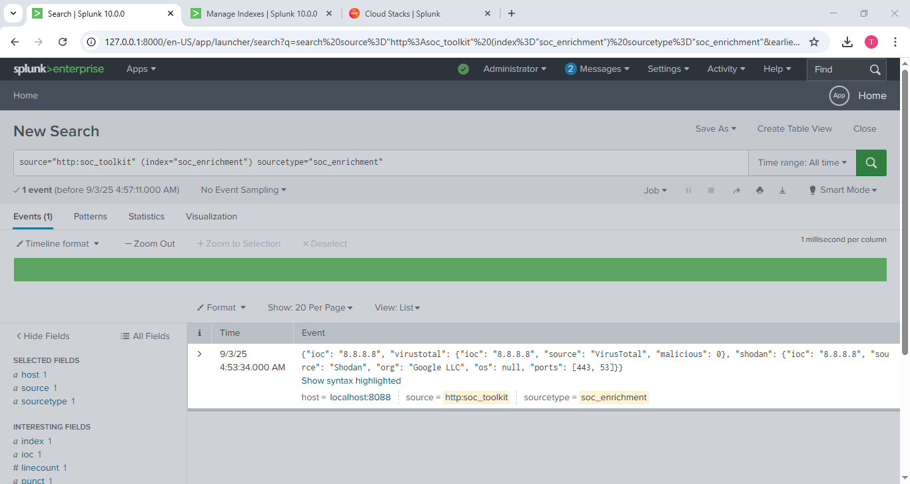
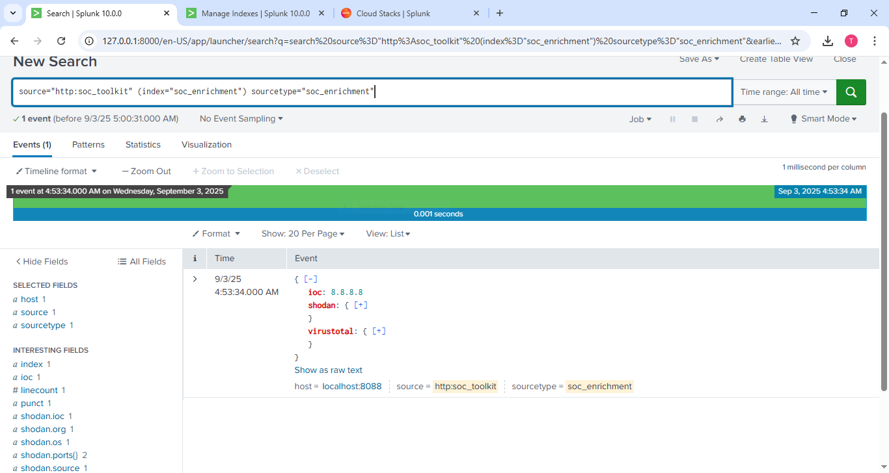
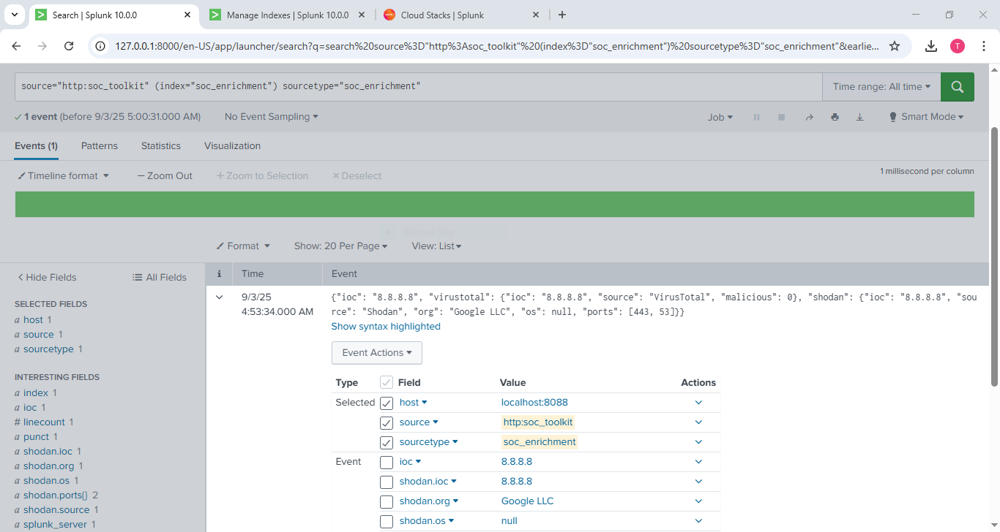
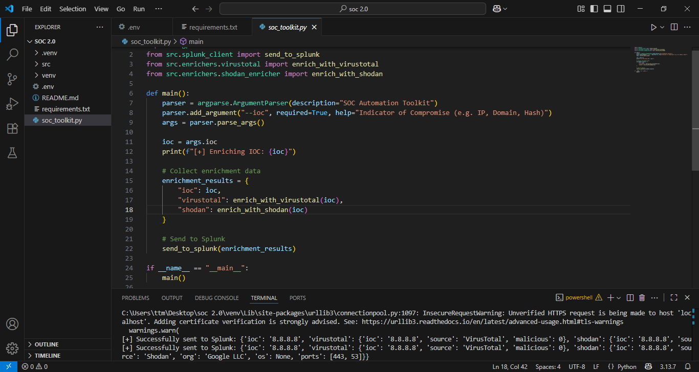
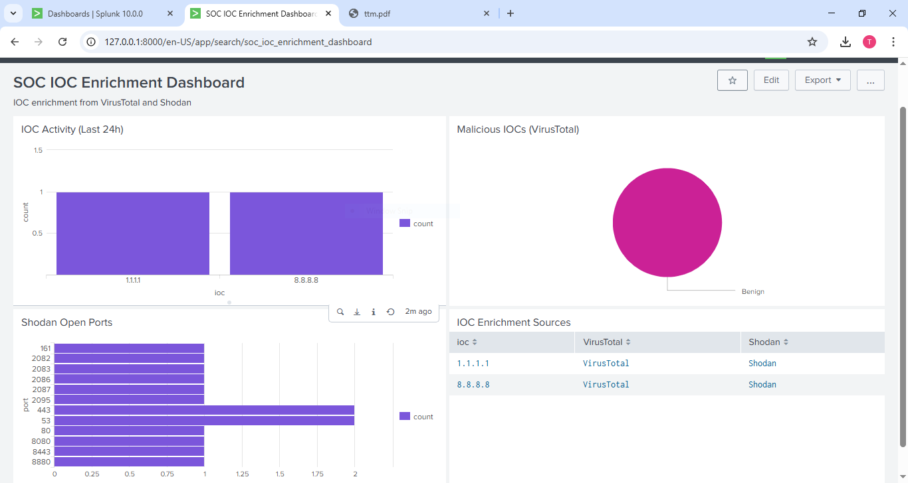

# 🛡️ SOC Automation Toolkit

The **SOC Automation Toolkit** helps security teams enrich Indicators of Compromise (IOCs) using **VirusTotal** and **Shodan** APIs, and then sends the enriched results directly to **Splunk** for visualization and investigation.

---

## 🚀 Features
- 🔍 IOC Enrichment (IP, Domain, Hash)
- 🧩 VirusTotal & Shodan Integration
- 📡 Automated Splunk Forwarding (via HEC)
- 📊 Splunk Dashboards for Security Insights
- ⚡ Simple CLI Tool – easy to run

---

## 📂 Project Structure

soc-automation-toolkit/
│-- src/
│ │-- enrichers/
│ │ ├── virustotal.py
│ │ ├── shodan_enricher.py
│ │-- splunk_client.py
│ │-- config.py
│-- .env
│-- soc_toolkit.py
│-- requirements.txt
│-- README.md


---

## 🖼️ Screenshots















---

## ⚙️ Installation
```bash
# Clone the repo
git clone https://github.com/yourusername/soc-automation-toolkit.git
cd soc-automation-toolkit

# Create virtual environment
python -m venv venv
source venv/bin/activate  # (Linux/Mac)
venv\Scripts\activate     # (Windows)

# Install dependencies
pip install -r requirements.txt

Configuration

Create a .env file in the project root:
VT_API_KEY=your_virustotal_api_key
SHODAN_API_KEY=your_shodan_api_key
SPLUNK_HEC_URL=https://localhost:8088/services/collector
SPLUNK_HEC_TOKEN=your_splunk_hec_token
SPLUNK_INDEX=soc_enrichment
SPLUNK_SOURCE=soc_toolkit
SPLUNK_SOURCETYPE=soc:enrichment

Usage
python soc_toolkit.py --ioc 8.8.8.8

Output:
[+] Enriching IOC: 8.8.8.8
[+] Successfully sent to Splunk: { ... }

Splunk Dashboard

Import the provided dashboard XML into Splunk Classic Dashboard Editor to visualize IOC enrichments.#
